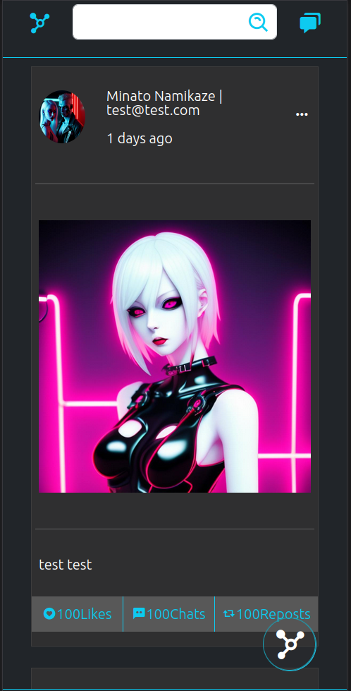

# Network

## Project setup

### This is a social web app ,developed with MEVN stack, called "Network".

```
Requirements in your device
{
    NODE
    VUE CLI
    NPM
    NVM (Node Version Manager to manage the node versions)
    MONGO DB
}
1 . Download zip file
2 . cd Downloads/frontend/
3 . npm install
4 . cd server
5 . npm install
```

### Compiles and hot-reloads for development

```
1 . npm run serve (in the frontend directory)
2 . npm run dev (in the server directory)
3 . make sure that your MongoDB server has started.
```

## Introduction

<p align="center">
  
</p>

### Compiles and minifies for production

```
npm run build
```

### Lints and fixes files

```
npm run lint
```

### Customize configuration

See [Configuration Reference](https://cli.vuejs.org/config/).
